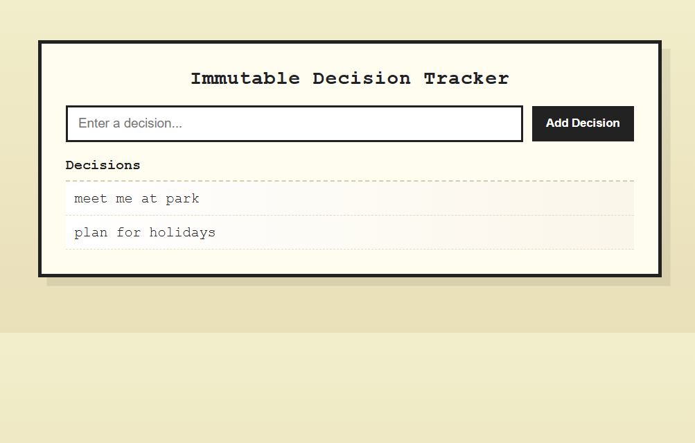

#  🧠Immutable Decision Tracker 

> A beginner-friendly JavaScript project to track decisions step-by-step using **Immutable.js**, ensuring past states are never lost.    

---

## 🪞 Overview  
The **Immutable Decision Tracker** helps users record and manage decisions in a clean and predictable way.  
Instead of mutating data directly, the app uses **Immutable.js** to preserve previous states, making state management safer and easier to understand.

This project is perfect for beginners who want hands-on practice with immutable data structures while building a real, functional JavaScript app.

What makes it unique is that **every update creates a new state** — nothing is overwritten. 

---

## 🚀 Features  

- 📝 Add decisions using a simple input
- 🔒 Manage state immutably with Immutable.js
- 💾 Save decisions using `localStorage`
- 🔄 Automatically re-render UI on state changes

---

## 🧱 Tech Stack  
| Technology | Purpose |
|-----------|---------|
| **HTML5** | Structure of the app |
| **CSS3** | Styling and layout |
| **JavaScript (ES6)** | App logic and interactivity |
| **Immutable.js** | Immutable state management |
| **LocalStorage API** | Persisting user decisions |

---

## 📚 What We Have Studied  
> Key JavaScript concepts practiced while building this project 🧩

- ES6 Modules (`import` / `export`)
- Immutable data structures (`List, Map`)
- Pure functions and predictable state updates
- Separation of concerns (state, UI, handlers)
- DOM manipulation and event handling
- Browser `localStorage 

---

## 🌿 Lessons Learned  
> - Immutability helps prevent accidental bugs  
> - State becomes easier to track and debug  
> - Breaking code into modules improves readability  
> - Small projects are powerful learning tools 

---

## 🖼️ Screenshots / Demo  

   

---

## 💫 Author  
👩‍💻 **Created by [Aliya](https://github.com/aliyasyeddd)**  
> _“Build. Break. Learn. Repeat.”_ 🌸  

---